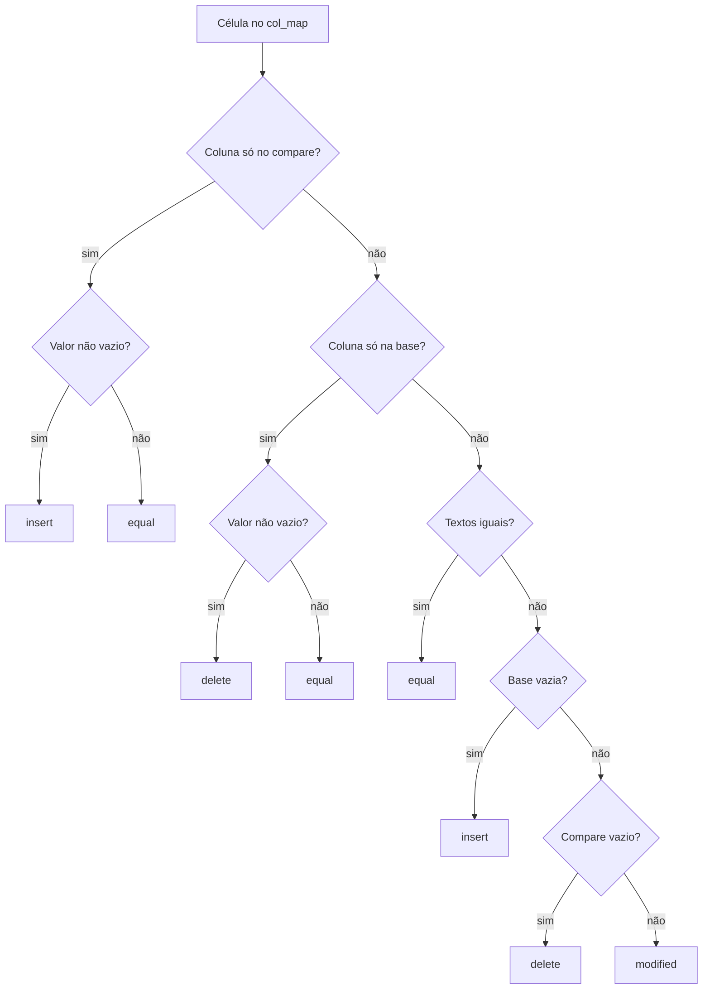

# Comparação Excel (XLSX) — Estratégias, Regras e Implementação

Documento de referência interna sobre tudo que existe hoje no repositório para comparar planilhas `.xlsx` / `.xlsm`.

**Arquivos principais**

| Arquivo | Responsabilidade |
|---------|------------------|
| `app/xlsx/extract.py` | Leitura e normalização de células |
| `app/xlsx/compare.py` | Motor de diff estrutural (abas, colunas, linhas, células) |
| `app/xlsx/redline.py` | Geração do XLSX redline + aba Summary |
| `app/output/redline_xlsx.py` | Gravação do redline em disco |
| `app/jobs.py` | Orquestração — par XLSX gera redline .xlsx |
| `tests/test_xlsx_compare.py` | Testes do pipeline extract → compare → redline |
| `web/index.html` | UI de comparação |

**Stack:** Python + openpyxl (sem dependência de Excel instalado).

---

## Visão geral do pipeline

```
XLSX base + XLSX compare
        ↓
extract_sheets()          → grid estruturado por aba/célula
        ↓
compare_xlsx()            → XlsxDiff (alinhamento + classificação)
        ↓
generate_redline_xlsx()   → workbook base preservado + marcações + Summary
```

A comparação é **estrutural em nível de célula**, não um diff de texto genérico. O documento base é a fundação visual do resultado — formatação, larguras de coluna e estilos partem dele.

---

## Estratégia 1 — Extração com fórmulas preservadas

**Regra:** ler o workbook com `data_only=False`.

- Fórmulas são detectadas por texto que começa com `=`.
- O diff compara o **texto da fórmula**, não só o valor calculado.
- Duas versões com a mesma fórmula mas resultado diferente (por mudança em outra célula) não aparecem como alteração de fórmula — só o que mudou no texto da célula conta.

**Normalização de valores para diff estável** (`_cell_value_to_str`):

| Tipo | Regra |
|------|-------|
| `None` | `""` |
| `bool` | `"TRUE"` / `"FALSE"` |
| `float` inteiro | `1.0` → `"1"` (evita falso positivo `1` vs `1.0`) |
| `float` decimal | `f"{value:.10g}"` (remove zeros à direita) |
| Fórmula | string literal com `=` |
| Demais | `str(value)` |

---

## Estratégia 2 — Alinhamento de abas por nome

**Regra:** abas são pareadas pelo **nome exato** da worksheet.

| Situação | Tratamento |
|----------|------------|
| Aba só na base | `base_only=True` — toda a aba marcada como deletada |
| Aba só no compare | `compare_only=True` — toda a aba marcada como inserida |
| Aba em ambos | diff linha a linha via `_compare_sheets()` |

Ordem de processamento: segue a ordem das abas do documento **base**. Abas novas do compare entram no final.

**Contagem de linhas não vazias:** uma linha conta se **qualquer célula** tiver valor não vazio (`any(cell.value for cell in row)`).

---

## Estratégia 3 — Alinhamento de colunas pelo cabeçalho

**Regra:** a **primeira linha** de cada aba é tratada como cabeçalho para alinhar colunas entre base e compare — mesma ideia usada em tabelas DOCX.

**Normalização de cabeçalho:**
```text
" ".join(cell.value.casefold().split())
```
- case-insensitive
- espaços múltiplos colapsados

**Alinhamento:** `difflib.SequenceMatcher` nos cabeçalhos normalizados, com `autojunk=False`.

**Fallback** (aba sem linhas): alinhamento posicional até `max(base.max_col, compare.max_col)`.

**Resultado:** `col_map` — lista de pares `(base_col_idx0, compare_col_idx0)` onde índices são 0-based e `None` indica coluna exclusiva de um lado.

| Opcode | Regra de emparelhamento |
|--------|-------------------------|
| `equal` | pareia colunas 1:1 na ordem |
| `replace` | pareia posicionalmente; sobras viram `None` de um lado |
| `delete` | colunas base sem par → `(i, None)` |
| `insert` | colunas compare sem par → `(None, j)` |

---

## Estratégia 4 — Fingerprints de linha só nas colunas comuns

**Problema que resolve:** se uma coluna é inserida no meio, o texto tab-joined da linha inteira muda em todas as linhas — o `SequenceMatcher` perderia âncoras e trataria tudo como substituição.

**Regra:** fingerprints são calculados **apenas nas colunas mapeadas em ambos os lados** (`base_c is not None and compare_c is not None`).

```text
fingerprint da linha = "\t".join(valores das colunas comuns)
```

Células fora do mapa comum não entram no alinhamento de linhas — mas entram no diff célula a célula depois do alinhamento.

---

## Estratégia 5 — Alinhamento de linhas em duas fases

### Fase A — SequenceMatcher global

`difflib.SequenceMatcher(None, base_fps, compare_fps, autojunk=False)` sobre os fingerprints.

| Opcode | Ação |
|--------|------|
| `equal` | linhas pareadas como `equal` (diff célula a célula) |
| `delete` | linha pura deletada |
| `insert` | linha pura inserida |
| `replace` | bloco ambíguo → Fase B |

### Fase B — Re-pareamento dentro de blocos `replace`

**Problema:** um bloco `replace` pode misturar linhas modificadas com linhas novas/removidas (ex.: `"TOTAL"` vs `"W Investor"`).

**Algoritmo `_best_row_alignment`:**
1. Matriz de similaridade entre todos os pares `(bi, ci)` do bloco via `SequenceMatcher.ratio()` nos fingerprints.
2. Ordenação decrescente por ratio.
3. Pareamento **greedy**: pega o maior ratio, remove linha base e compare usadas, repete.
4. **Limiar mínimo: `MIN_SIMILARITY = 0.60`** — abaixo disso, não pareia (vira delete/insert puro).

**Regra de ordenação na saída** (`_replace_item_sort_key`):
- Pares e inserts seguem a **ordem do documento compare** (onde a linha nova “deveria” aparecer).
- Deletes puros ficam **ao lado da linha base que as precedia**, mapeados para a posição compare do par seguinte.
- Se não há par depois, vão para o final do bloco.

---

## Estratégia 6 — Diff célula a célula

Para cada par de linhas alinhadas, cada posição do `col_map` gera um `CellDiff`.

**Status possíveis:** `equal` | `insert` | `delete` | `modified`

| Condição | Status |
|----------|--------|
| Coluna só no compare (`base_c is None`) | `insert` se célula tem valor; senão `equal` |
| Coluna só na base (`compare_c is None`) | `delete` se célula tem valor; senão `equal` |
| Ambos existem, valores iguais | `equal` |
| Base vazia, compare com valor | `insert` |
| Base com valor, compare vazio | `delete` |
| Ambos com valor, textos diferentes | `modified` |

**Status de linha (`RowStatus`):**

| Condição | Status |
|----------|--------|
| Bloco `equal` sem mudança em nenhuma célula | `equal` |
| Qualquer célula alterada | `replace` |
| Linha inteira só na base | `delete` |
| Linha inteira só no compare | `insert` |

---

## Estratégia 7 — Classificação estatística (estilo Litera)

Além do `SummaryStats` genérico (deletions / insertions / moved), existe `XlsxStats` com métricas específicas de planilha:

| Métrica | O que conta |
|---------|-------------|
| `row_add` | linhas com status `insert` |
| `row_del` | linhas com status `delete` |
| `col_add` | entradas no `col_map` com `(None, compare_c)` |
| `col_del` | entradas no `col_map` com `(base_c, None)` |
| `value_changes` | célula modificada sem fórmula em nenhum lado |
| `formula_and_value_changes` | fórmula em **ambos** os lados e valor mudou |
| `formula_only_changes` | fórmula em um lado (ou mudança de fórmula sem par formula-formula) |
| `modified_cells` | total de células com qualquer alteração |
| `emptied_cells` | célula que tinha valor na base e ficou vazia no compare (status `delete` em linha `replace`) |

**Regras de contagem no summary global:**
- Célula `modified` → +1 deletion e +1 insertion (paridade com redline DOCX).
- Célula `insert` em linha `replace` com texto → conta como `value_changes`.
- `moved` = **0** — detecção de movimento de linha **não implementada** no MVP XLSX.

---

## Estratégia 8 — Geração do redline visual

### Fundação = workbook base

1. Carrega o XLSX base como template (preserva estilos, larguras, formatos).
2. Roda `compare_xlsx()` para obter o diff.
3. Reconstrói cada aba a partir do `SheetDiff`.
4. Anexa aba **Summary**.

### Marcações por tipo de célula

| Status | Visual |
|--------|--------|
| `equal` | valor da base, estilo preservado |
| `insert` | valor do compare, fonte azul sublinhada |
| `delete` | valor da base, fonte vermelha tachada; se compare esvaziou a célula → fundo vermelho pálido (~12% da cor de deleção) |
| `modified` (ambos com valor) | rich text inline: valor antigo (vermelho tachado) + valor novo (azul sublinhado), **sem seta**, lado a lado |
| `modified` (base → vazio) | valor antigo tachado + fundo pálido |
| `modified` (vazio → compare) | valor novo sublinhado |

**Cores padrão** (`ColorConfig`):
- Deleção: `#DC2626`
- Inserção: `#2563EB`
- Movido: `#16A34A` (definido, mas movimento não ativo)

**Regra de estilo:** `_apply_font_preserving_style` mescla a fonte de marcação com a fonte existente da célula (nome, tamanho, bold) — não sobrescreve tudo.

### Abas especiais

| Caso | Comportamento |
|------|---------------|
| `compare_only` | copia aba inteira do compare, aplica fonte de inserção em todas as células não vazias |
| `base_only` | mantém aba do base, aplica fonte de deleção em todas as células não vazias |
| Coluna inserida | largura copiada da coluna correspondente no compare |

### Aba Summary

Espelha o relatório estilo **Litera Compare**:
- Título + data da comparação (`dd/mm/YYYY`)
- Metadados: arquivos base/compare, value changes, modified cells
- Blocos coloridos: Row Add/Del, Col Add/Del, Formula And Value Change, Formula Change Only, Emptied Cells
- Tabela Deletions / Insertions / Moved
- Lista aba a aba com contagem de mudanças

Nome da aba: `Summary`, ou `Compare Summary` / `Compare Summary N` se já existir.

---

## API e frontend

### Endpoints

| Endpoint | Retorno |
|----------|---------|
| `POST /api/compare/xlsx-json` | JSON com summary, stats, lista de abas |
| `POST /api/compare/xlsx` | arquivo `.xlsx` redline para download (`[Redline] {nome_base}.xlsx`) |

### Validação de upload

- Extensões aceitas: `.xlsx`, `.xlsm`
- Tamanho máximo: **25 MB** por arquivo

### UI (frontend)

- Modo **single file** apenas — batch ainda não existe para XLSX
- Toggle DOCX / XLSX na mesma tela
- Preview: estatísticas + lista de abas alteradas
- Download do redline com cores configuráveis via `ColorPicker`
- Inversão base/compare disponível no fluxo single

---

## O que está coberto pelos testes

| Teste | Valida |
|-------|--------|
| `test_compare_detects_modified_inserted_and_equal_rows` | detecta linha modificada (Bob), inserida (Dave) e iguais |
| `test_compare_detects_inserted_column_without_breaking_row_alignment` | coluna no meio não quebra alinhamento de linhas |
| `test_redline_xlsx_produces_valid_workbook_with_summary` | roundtrip openpyxl + aba Summary |
| `test_redline_preserves_rich_text_for_modified_cells` | rich text com valores antigo e novo no XML |
| `test_redline_marks_inserted_row_with_insertion_font` | estilos de inserção no `styles.xml` |

---

## Limitações conhecidas (MVP)

| Limitação | Detalhe |
|-----------|---------|
| Sem detecção de movimento | `moved` sempre 0; linha que mudou de posição pode aparecer como delete + insert |
| Cabeçalho fixo na linha 1 | planilhas sem cabeçalho na primeira linha alinham colunas de forma menos precisa |
| Sem comparação de formatação | só valor/fórmula textual; mudança só de cor/fonte não é detectada |
| Sem batch | um par de arquivos por vez |
| Sem `.xls` legado | só OOXML (`.xlsx` / `.xlsm`) |
| Gráficos, comentários, validações | não entram no diff |
| Células mescladas | não há tratamento especial |
| Macros (`.xlsm`) | aceito no upload; macros não são comparadas |
| Fórmula vs valor calculado | se a fórmula é igual mas o cache de valor difere, não marca mudança |

---

## Relação com a visão analítica (compareDocx)

O arquivo `COMPAREDOCX_ANALYSIS.md` descreve um projeto **complementar** que gera relatório tabular de DOCX (estilo Excel lado a lado). No repositório atual:

- **XLSX** → redline **dentro da planilha** (documento marcado), inspirado no Litera Compare
- **compareDocx (referência)** → relatório **fora do documento** (planilha como auditoria de parágrafos)

Ideias do compareDocx ainda **não portadas** para o pipeline XLSX:
- classificação semântica de mudanças (versão, formatação, conteúdo)
- hierarquia de seções
- fingerprint por primeiras/últimas palavras (usamos tab-join de colunas comuns)
- export HTML/JSON/CSV do relatório
- LLM para descrição em linguagem de negócio

---

## Diagrama de decisão — uma célula



---

## Em uma frase

> Comparamos planilhas alinhando abas por nome, colunas pelo cabeçalho da primeira linha e linhas por fingerprint nas colunas comuns — depois diff célula a célula com marcação visual no workbook base e estatísticas no estilo Litera.
